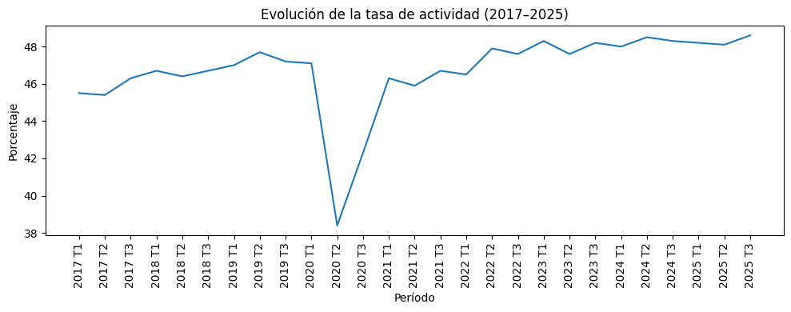
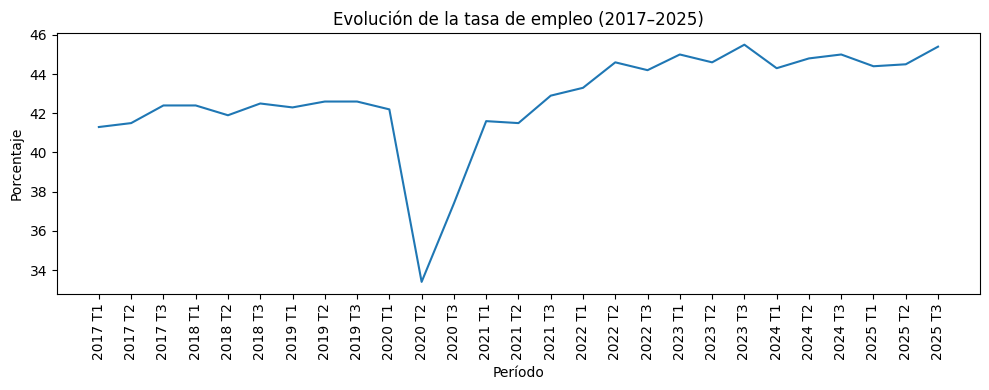
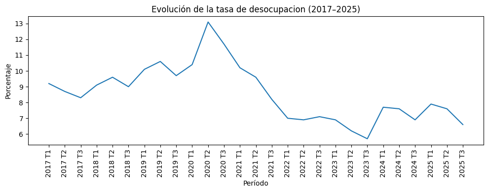
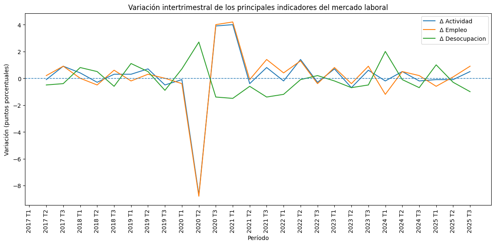
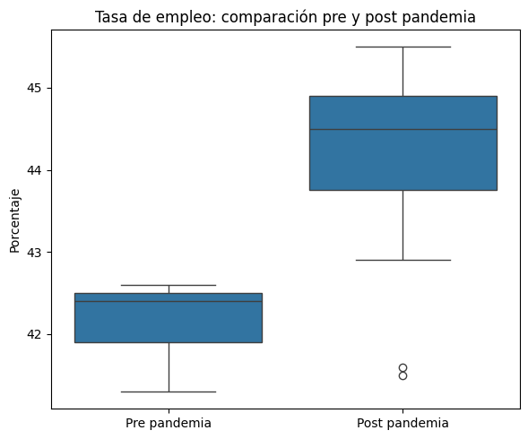
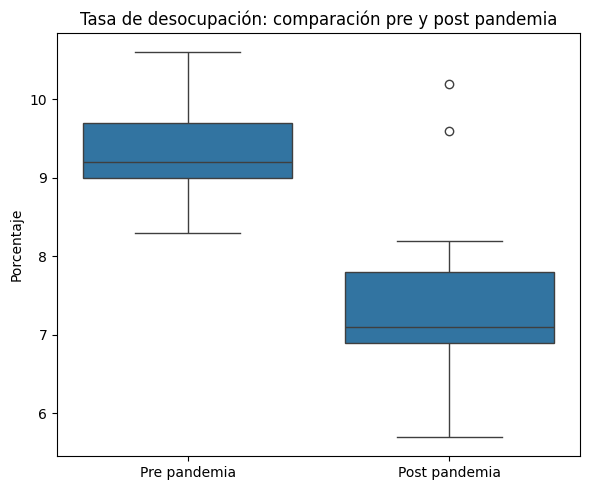

# 💼 Análisis del Mercado Laboral Argentino (2017–2025)


## 📋 Descripción

Análisis exploratorio de datos (EDA) del mercado laboral argentino entre **2017 y 2025**, utilizando microdatos y series oficiales de la **Encuesta Permanente de Hogares (EPH – INDEC)**.
El estudio se centra en la evolución de los principales indicadores laborales, su comportamiento temporal y su relación con distintos contextos económicos y sociales.

## 🎯 Objetivos

* Analizar la evolución temporal de los principales indicadores laborales
* Estudiar tasas de actividad, empleo y desocupación
* Identificar períodos de estabilidad, crisis y recuperación
* Detectar valores extremos y quiebres estructurales
* Visualizar resultados de forma clara y reproducible

## 📊 Datos

* **INDEC – EPH**:

  * Tasa de actividad
  * Tasa de empleo
  * Tasa de desocupación
  * Población económicamente activa
* Frecuencia trimestral
* Periodo: **2017–2025**
* Datos procesados desde Excel / CSV a formato analizable con Python

## 📈 Análisis Realizado

* Evolución temporal de indicadores laborales clave
* Variación intertrimestral e interanual
* Identificación de tendencias y cambios de régimen
* Análisis descriptivo y visualización estadística
* Comparación entre distintos períodos económicos

## 📉📈 Hallazgos Principales

**Períodos críticos:**

* 2018–2019: deterioro del empleo y aumento de la desocupación
* 2020: fuerte impacto de la pandemia COVID-19

**Períodos de recuperación:**

* 2021–2022: mejora gradual del empleo
* 2023–2024: recuperación parcial con alta volatilidad

**Conclusiones:**

1. Alta sensibilidad del mercado laboral a shocks macroeconómicos
2. Recuperaciones más lentas que las caídas
3. Persistencia de niveles elevados de informalidad y desocupación
4. Importante heterogeneidad temporal entre trimestres

## 📊 Indicadores Clave del Mercado Laboral Argentino

A continuación se presentan los principales indicadores analizados, junto con su evolución temporal y los cambios observados en distintos contextos macroeconómicos.

### Tasa de Actividad

Evolución trimestral de la participación de la población en el mercado laboral.



---

### Tasa de Empleo

Análisis de la dinámica del empleo a lo largo del período observado.



---

### Tasa de Desocupación

Evolución del desempleo y detección de períodos de mayor inestabilidad.



---

### Variación Intertrimestral

Cambios porcentuales entre trimestres consecutivos para identificar aceleraciones o desaceleraciones.



---

### Impacto de la Pandemia (COVID-19)

**Empleo durante la pandemia**
Cambios en la tasa de empleo durante el período 2020–2021.



**Desocupación durante la pandemia**
Evolución de la tasa de desocupación en el mismo período.



## 📊 Dashboard Interactivo – Mercado Laboral Argentino (2017–2025) 

**Análisis exploratorio del mercado laboral (EPH – INDEC)**
Dashboard interactivo desarrollado en Power BI que presenta un análisis exploratorio (EDA) del mercado laboral argentino entre 2017 y 2025, a partir de datos oficiales de la Encuesta Permanente de Hogares (EPH) del INDEC. 
El dashboard permite analizar la evolución temporal de los principales indicadores laborales —tasa de actividad, empleo, desocupación y subocupación—, incorporando comparaciones trimestrales e interanuales, así como un análisis del período pre y post pandemia.


---

## 🛠️ Tecnologías

* Python 3.8+
* Pandas, NumPy
* Matplotlib / Seaborn
* Google Colab / Jupyter Notebook

## 🚀 Ejecución

```bash
git clone https://github.com/alejotrenti/mercado-laboral-argentino.git
cd mercado-laboral-argentino
```

Abrir `notebook/analisis_mercado_laboral.ipynb` y ejecutar las celdas en orden.

## 📂 Estructura

```
mercado-laboral-argentino/
├── README.md
├── requirements.txt
├── notebook/
│   └── analisis_mercado_laboral.ipynb
├── data/
│   ├── raw/
│   │    └── mercado_laboral_fuente.xlsx
│   └── processed/
│        └── mercado_laboral_limpio.xlsx
└── images/
    ├── tasa_actividad.png
    ├── tasa_empleo.png
    ├── tasa_desocupacion.png
    ├── variacion_intertrimestral.png
    └── extremos.png
```

## 👤 Autor

**Alejo** – Estudiante de Ciencia de Datos – Argentina 🇦🇷
